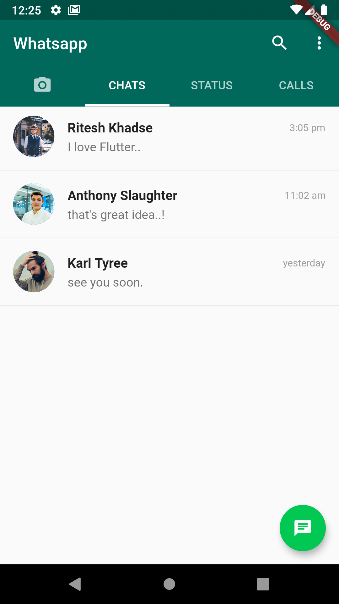
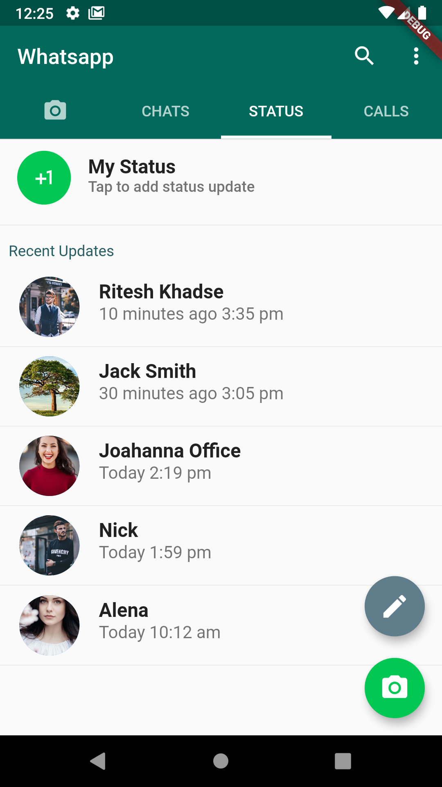

# whatsapp_ui

Whatsapp UI build using **Flutter (dart)**

## For newbies

A few resources to get you started if this is your first Flutter project:

- [Lab: Write your first Flutter app](https://flutter.dev/docs/get-started/codelab)

- [Cookbook: Useful Flutter samples](https://flutter.dev/docs/cookbook)

## Getting started:

- Run `flutter pub get` in the project directory.
- Start android emulator or connect mobile & enable ADB.
- Run command `flutter run`

### Screenshots:

    
    

